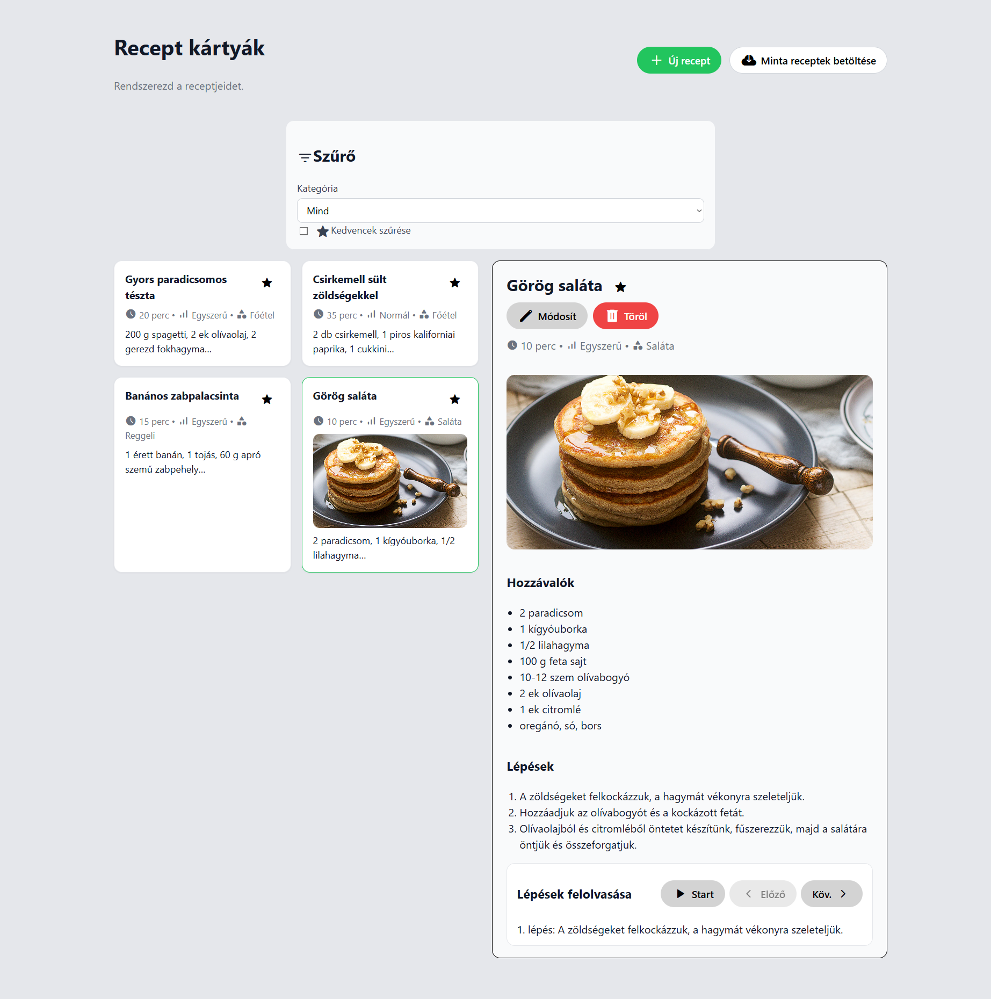

<div align="center">
  <h1>Recept kártyák — React app</h1>
</div>

Ez a repó egy egyszerű, de jól strukturált receptkezelő alkalmazást tartalmaz React és TypeScript alapokon. A cél egy letisztult, gyorsan használható felület, ahol saját receptjeidet tudod rögzíteni, kategorizálni, kedvencnek jelölni, valamint a lépéseket géphanggal felolvastatni. A receptek a böngésző LocalStorage‑ában tárolódnak, így frissítés után is megmaradnak.

### Kiemelt funkciók:
- Receptlista és részletes nézet
- Új recept felvétele és szerkesztése (hozzávalók, lépések)
- Helyi képfájl feltöltése vagy kép URL megadása a receptekhez
- Kedvencek jelölése, csak kedvencek szűrő
- Kategória szerinti szűrés (középre igazított, téglalap szekció)
- Minta receptek betöltése a `public/sample-recipes.json` forrásból
- Lépések hangos felolvasás (Web Speech API)
- Material Design alapú ikonok (Google Fonts Material Symbols)

---

<p align="center">
  
</p>

---

### Előfeltételek
- Node.js 18+ (ajánlott LTS)
- npm vagy kompatibilis csomagkezelő


### Telepítés és futtatás
```bash
npm install
npm run dev
```
Alapértelmezés szerint a Vite fejlesztői szerver nyílik meg a böngészőben.

Produkciós build létrehozása:
```bash
npm run build
npm run preview
```


### Parancsok
- `npm run dev` – fejlesztői szerver indítása (Vite)
- `npm run build` – produkciós build `dist` mappába
- `npm run preview` – helyi előnézet a buildelt állományokról
- `npm run lint` – ESLint ellenőrzés


### Fő komponensek és fájlok

#### App és elrendezés
- `src/App.tsx`
  - A teljes alkalmazás állapotát kezeli: receptek, kijelölés, szűrők, szerkesztés.
  - A receptek `useLocalStorage` hookkal tartósítva vannak a böngésző LocalStorage‑ában.
  - Műveletek: létrehozás, mentés (új vagy meglévő frissítése), törlés, kedvenc kapcsolása.
  - Kiszámítja a kategória listát és a szűrt nézetet memóizálva (`useMemo`).

- `src/components/Layout.tsx`
  - Fejléc: címsor + akciógombok
    - “+ Új recept” – űrlap megnyitása
    - “Minta receptek betöltése” – beolvassa a `public/sample-recipes.json` állományt
  - Lábjegyzet: rövid állapotüzenet (ha még nincsenek receptek) a `FooterNotice` komponenssel.
  - Középen jeleníti meg az aktuális oldaltartalmat (lista + részletező/űrlap).


#### Lista nézet
- `src/components/RecipeList.tsx`
  - Rácsba rendezi a `RecipeCard` elemeket.
  - Átadja a kijelölés és kedvenc kapcsolás callbackeket.

- `src/components/RecipeCard.tsx`
  - Megjeleníti a recept címét, meta adatait, opcionális képet, hozzávalók rövidített listáját.
  - Kedvencek gomb: Material Design csillag ikon (kitöltött/üres állapot) a `FavoriteToggle` segítségével.
  - A kijelölt kártya finom skálázási animációt kap (`useRecipeHighlight`).
  - Opcionális mezők védett kezelése (pl. `ingredients ?? []`).

- `src/components/EmptyState.tsx`
  - Akkor jelenik meg, ha a szűrők alapján nincs egyetlen megjeleníthető recept sem.
  - Rövid üzenetet és egy „Új recept” gombot tartalmaz, ami az űrlapot nyitja meg.


#### Részletező és űrlap
- `src/components/RecipeDetail.tsx`
  - Megjeleníti a kijelölt recept teljes tartalmát.
  - Opcionális kép nagyobb előnézete, hozzávalók és lépések listája (`IngredientsList`, `StepsList`).
  - “Módosít” és “Töröl” akciók Material ikonokkal; törlés előtt böngészős megerősítés.
  - Integráció a `StepGuide` komponenssel a lépések felolvasásához.

- `src/components/RecipeForm.tsx`
  - Új recept készítése vagy meglévő szerkesztése.
  - Hozzávalók és lépések soronkénti megadása, mentéskor tömbbé alakítva.
  - Képkezelés:
    - Helyi képfájl feltöltése (`<input type="file" accept="image/*">`), 4 MB méretkorlát, MIME ellenőrzés.
    - A fájl `FileReader` segítségével Data URL-re konvertálva kerül az `imageUrl` mezőbe, így LocalStorage‑ban tartós.
    - Opcionálisan továbbra is megadható külső kép URL.
    - Beépített előnézet és „Kép eltávolítása” gomb.


#### Szűrők és kedvencek
- `src/components/CategoryFilter.tsx`
  - Kategória kiválasztása („Mind” opcióval), felül egy szűrő UI‑szekcióban.
  - Csak kedvencek kapcsoló – kis csillag ikonnal; a szűrés állapotát visszaadja a szülőnek.
  - Stílus: a `src/styles/App.css` fájlban a `.category-filter` egy középre igazított, téglalap alakú szekció, max. 640 px szélességgel.

- `src/components/FavoriteToggle.tsx`
  - Általános célú kedvenc‑csillag gomb, kártyán és részletező nézetben is használható.
  - A `variant` prop alapján eltérő stílus alkalmazható.


#### Lépésfelolvasó és animáció
- `src/components/StepGuide.tsx` + `src/hooks/useStepGuide.ts`
  - A Web Speech API (SpeechSynthesis) használatával felolvassa a lépéseket.
  - Vezérlők Material ikonokkal: Start/Stop (play/stop), Előző/Következő (chevron ikonkészlet); kijelzi a pillanatnyi lépést.
  - A `useStepGuide` hook felel a beszéd indításáért/leállításáért és az aktuális lépés index kezeléséért.

- `src/hooks/useRecipeHighlight.ts`
  - Finom skálázási animáció, amikor egy receptkártya kijelölt állapotba kerül.
  - `requestAnimationFrame`‑re épül, a végén visszaállítja a `transform` értéket.


#### Típusok és segéd hookok
- `src/types.ts`
  - Központi típusok: `RecipeId`, `Difficulty`, `Recipe`.
  - A `Recipe` opcionális mezőket is tartalmaz (kép, idő, kategória stb.).

- `src/hooks/useLocalStorage.ts`
  - Általános célú hook: a React állapotot a böngésző LocalStorage‑ával tartja szinkronban.
  - Betöltéskor parse-ol, változáskor JSON‑t ír vissza.


### Állandó tárolás (LocalStorage)
A receptek a felhasználó böngészőjének LocalStorage‑ában tárolódnak a `recipes` kulcson. Előny: gyors és egyszerű, nem igényel backendet. Hátrány: eszközönként külön tároló, méretkorlát, és a privát böngészés törölheti.

Megjegyzés: a feltöltött képek Data URL formában tárolódnak, ezért méretkorlát (4 MB) védi a tárat.

### Minta receptek betöltése
A „Minta receptek betöltése” gomb a `public/sample-recipes.json` fájlból olvassa be a recepteket, és hozzáadja őket a meglévő listához. Ez segít gyorsan kipróbálni az alkalmazást.
